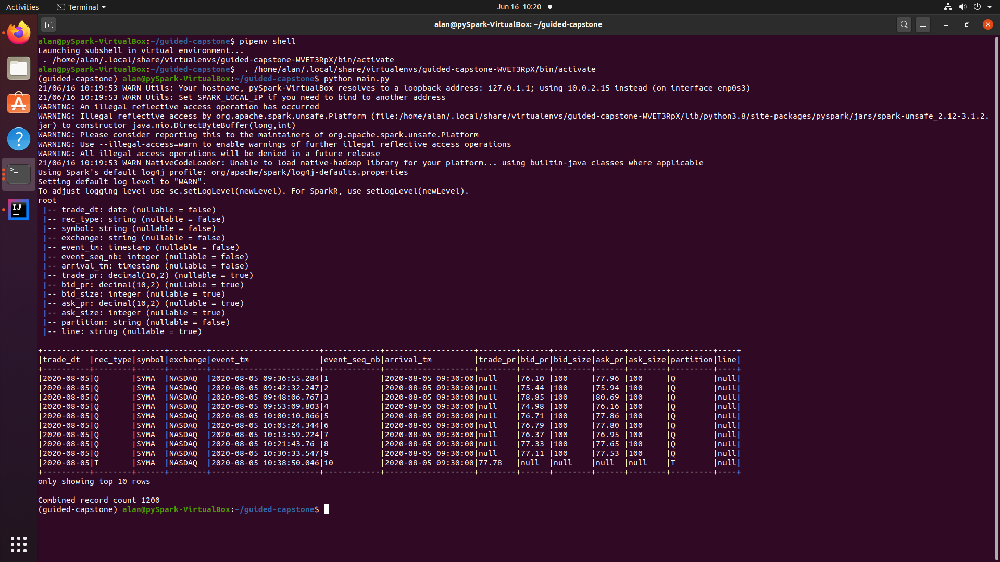
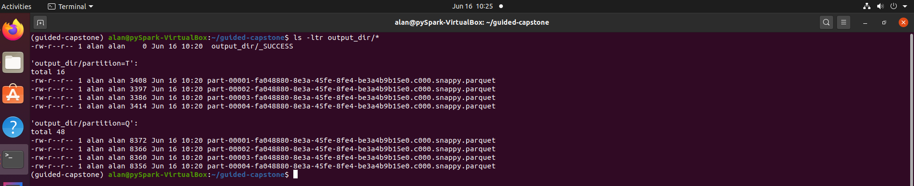
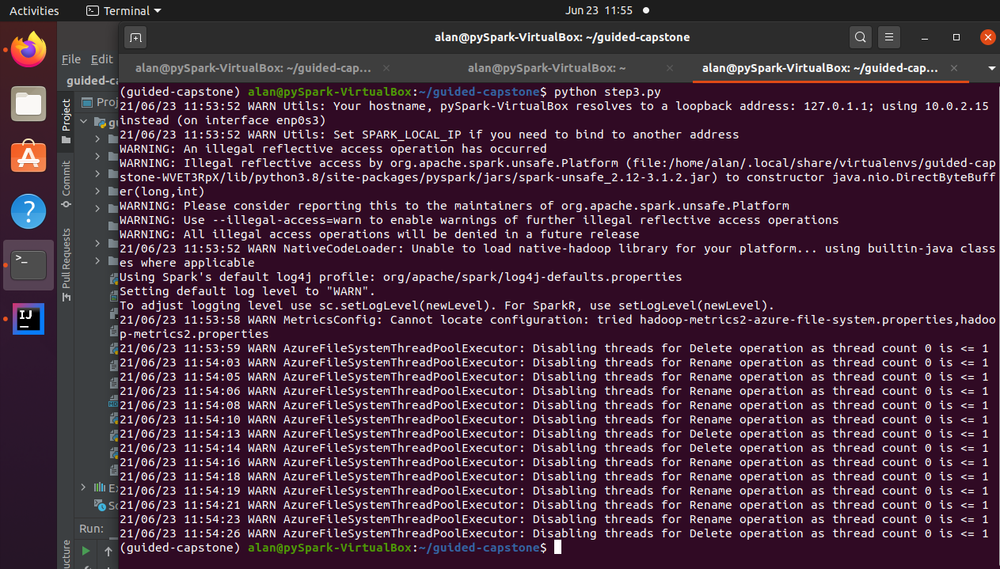
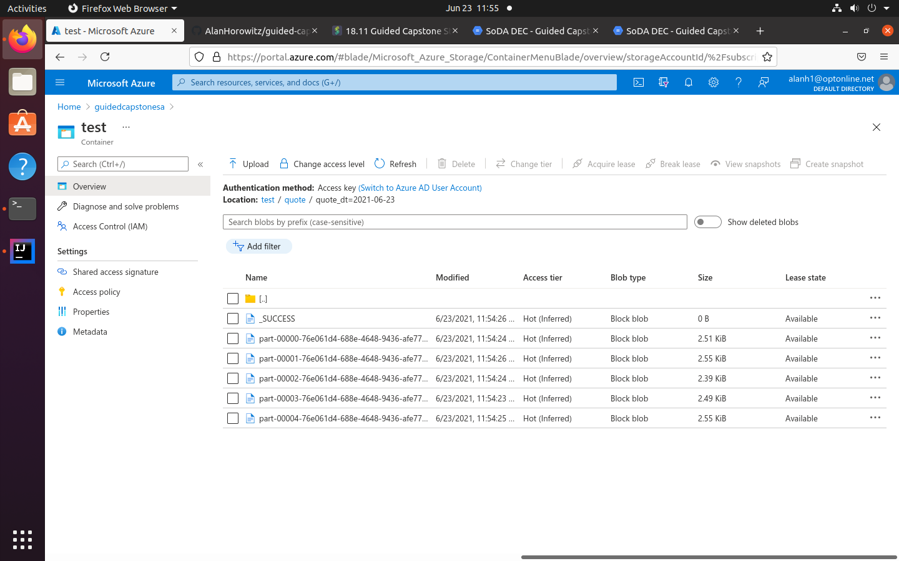

# Guided Capstone - Equity Market Data Analysis

## Step One -  Design and Setup

- Dataflow diagram: dataflow.png

## Step Two -  Data Ingestion

### Summary:  

Use Apache Spark RDD and dataframe APIs to read trade and quote data from csv and json sources, conform them to a common schema, and write the output to parquet.

### Note:

I could not get https:wasb// to access azure blob storage following the project instructions, so local files are used instead.  In a future step of the project, I will rehost on Azure Databricks and adjust the ingestion to use blob storage. 

### Environment

- java 11
- pipenv
- pipenv install pyspark

### Usage instructions:

```
pipenv shell
python main.py
```

### Command output



<br>

### Contents of parquet output directory



## Step Three: End-of-Day (EOD) Data Load

### Summary:

Recreate Quote and Trade dataframes, filter out-of-date records, and write to cloud storage.

### Usage instructions (following step 2):

```
python step3.py
```
### Command output



<br>

### Contents of parquet output directory




