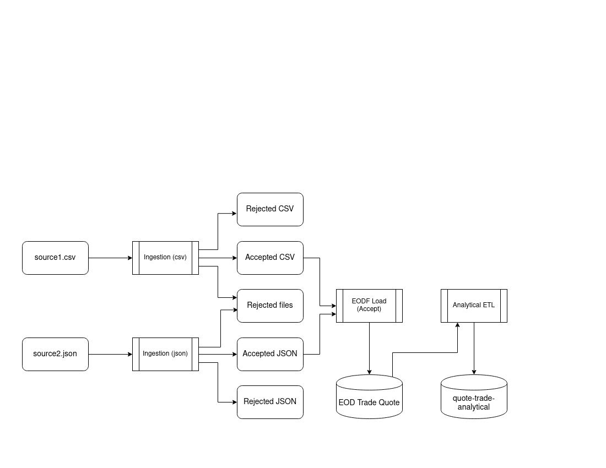
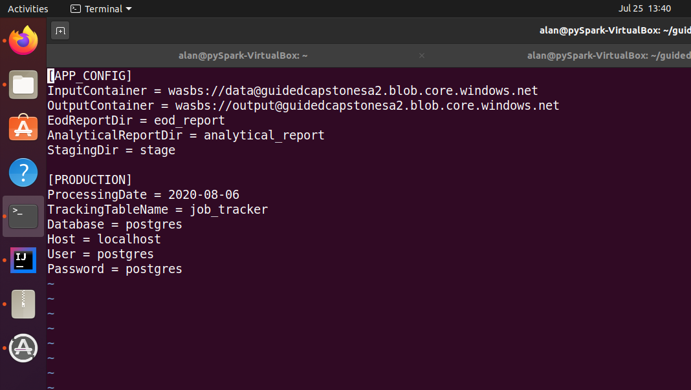
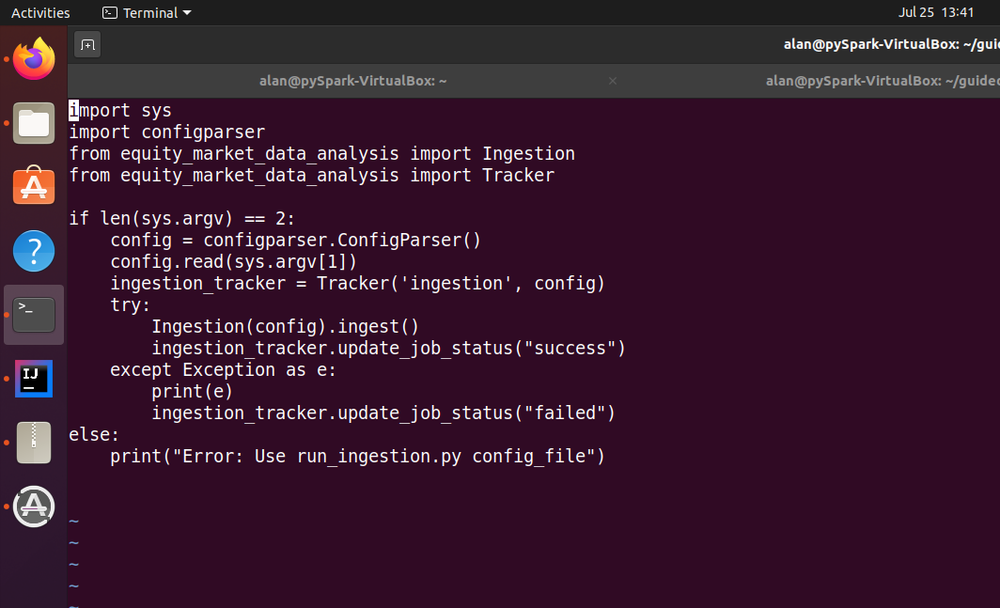
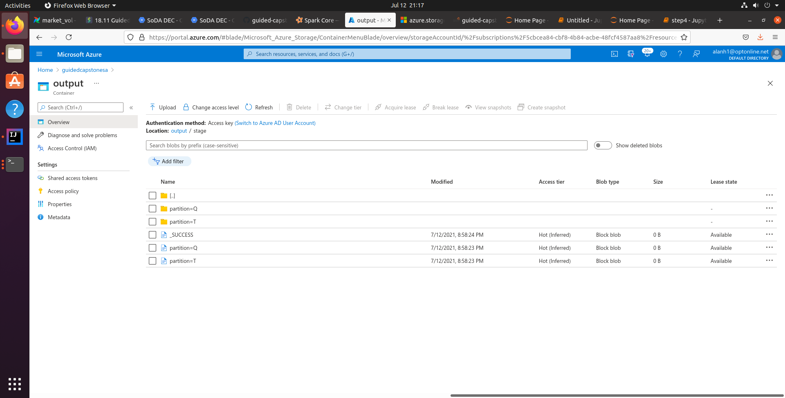
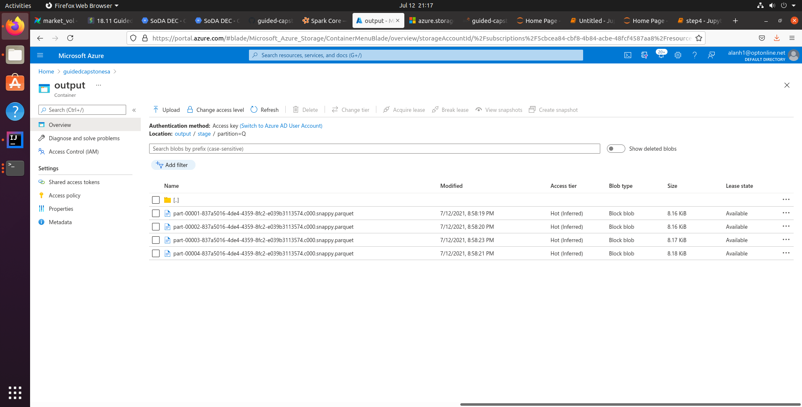

# Guided Capstone - Equity Market Data Analysis

### Summary: equity_market_data_analysis module

### equity_market_data_analysis implements a pipeline that ingests and analyzes market data from two exchanges.  The module exposes three classes:

- Ingestion - Reads, normalizes and stages a day of market data
- Reports - Runs EOD summary and analytical reports from a day of staged data
- Tracker - Records success or failure of pipeline steps to database

### This pipeline was deployed to a local Ubuntu pySpark and an Azure Databricks environment.

### Data flow



### Local Environment

- Ubuntu 20.04 
- java 11
- apt install postgresql  
- pipenv
- pipenv install pyspark==3.1.2
- pipenv install pytest==6.2.4
- pipenv install build

### Storage

- Azure Blob storage

### Modifications to local pySpark for wasb

From SPARK_HOME:
/home/alan/.local/share/virtualenvs/guided-capstone-WVET3RpX/lib/python3.8/site-packages/pyspark

- mkdir hadoop
- Create hadoop/core-site.xml with following contents:
```
<property>
<name>fs.azure.account.key.guidedcapstonesa.blob.core.windows.net</name>
<value><ACCOUNT_KEY></value>
</property>
```

- Modify bin/load-spark-env.sh to export HADOOP_CONF_DIR
``` 
SPARK_ENV_SH="spark-env.sh"
if [ -z "$SPARK_ENV_LOADED" ]; then
export SPARK_ENV_LOADED=1

export SPARK_CONF_DIR="${SPARK_CONF_DIR:-"${SPARK_HOME}"/conf}"
# modification for Azure wasb
export HADOOP_CONF_DIR=${SPARK_HOME}/hadoop
```
* Download following jars from mvnrepository.com to SPARK_HOME/jars

  * jetty-util-ajax-10.0.0.jar
  * jetty-util-6.0.1.jar
  * azure-storage-8.6.6.jar
  * hadoop-azure-3.1.2.jar
  
### Initialization

- create azure blob storage containers: data, output
- Use Azcopy to copy inputs to data container
- Create job tracking table in postgres

```
CREATE TABLE job_tracker (job_id VARCHAR(80), update_time TIMESTAMP, status VARCHAR(80));
```

<br>
config_local.ini

### Build and install equity market analysis module

- python -m build
- pipenv install .

## Ingestion

### Summary

Ingest data for 2020-08-06. Use Apache Spark RDD and dataframe APIs to read trade and quote data from csv and json sources, conform them to a common schema, and write the output to parquet.
<br>


<br>
run_ingestion.py

### Usage:

``` 
pipenv shell
spark-submit run_ingestion.py config-local.ini
```

### Results persisted as parquet in output/staging



<br>




## Reports

### Summary

- EOD report: filter out-of-date records, and write to cloud storage.
- Analytical report: Derive three metrics for each quote:
  - Latest trade price before the quote.
  - Latest 30-minute moving average trade price, before the quote.
  - The bid/ask price movement from previous day’s closing price.


