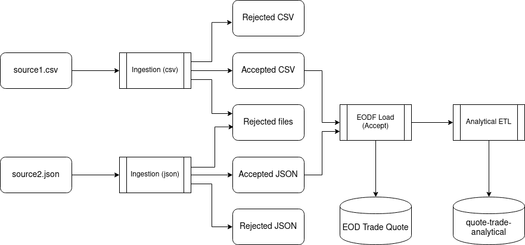
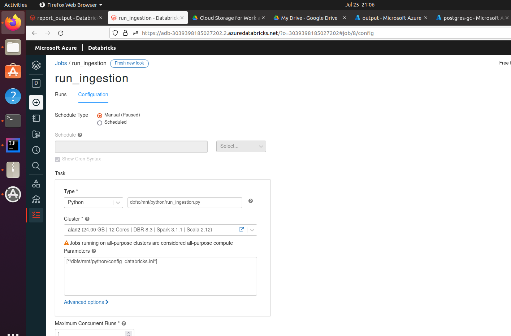
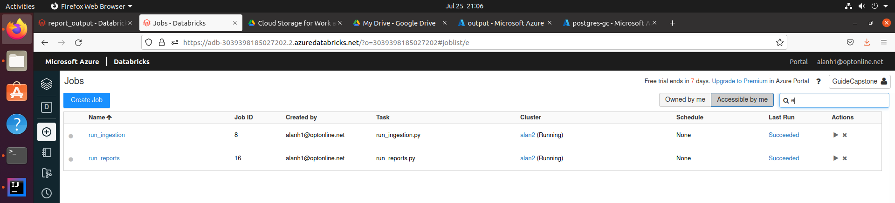

# Guided Capstone - Equity Market Data Analysis

### Summary: equity_market_data_analysis module

### equity_market_data_analysis implements a pipeline that ingests and analyzes market data from two exchanges.  The module exposes three classes:

- Ingestion - Reads, normalizes and stages a day of market data
- Reports - Runs EOD summary and analytical reports from a day of staged data
- Tracker - Records success or failure of pipeline steps to database

### This pipeline was deployed to a local Ubuntu pySpark and an Azure Databricks environment.

### Data flow



## Local Environment

- Ubuntu 20.04 
- java 11
- apt install postgresql  
- pipenv
- pipenv install pyspark==3.1.2
- pipenv install pytest==6.2.4
- pipenv install build

### Storage

- Azure Blob storage

### Modifications to local pySpark for wasb

From SPARK_HOME:
/home/alan/.local/share/virtualenvs/guided-capstone-WVET3RpX/lib/python3.8/site-packages/pyspark

- mkdir hadoop
- Create hadoop/core-site.xml with following contents:
```
<property>
<name>fs.azure.account.key.guidedcapstonesa.blob.core.windows.net</name>
<value><ACCOUNT_KEY></value>
</property>
```

- Modify bin/load-spark-env.sh to export HADOOP_CONF_DIR
``` 
SPARK_ENV_SH="spark-env.sh"
if [ -z "$SPARK_ENV_LOADED" ]; then
export SPARK_ENV_LOADED=1

export SPARK_CONF_DIR="${SPARK_CONF_DIR:-"${SPARK_HOME}"/conf}"
# modification for Azure wasb
export HADOOP_CONF_DIR=${SPARK_HOME}/hadoop
```
* Download following jars from mvnrepository.com to SPARK_HOME/jars

  * jetty-util-ajax-10.0.0.jar
  * jetty-util-6.0.1.jar
  * azure-storage-8.6.6.jar
  * hadoop-azure-3.1.2.jar
  
### Initialization

- create azure blob storage containers: data, output
- use azcopy to copy inputs to data container
- create job tracking table in postgres

```
CREATE TABLE job_tracker (job_id VARCHAR(80), update_time TIMESTAMP, status VARCHAR(80));
```

<br>
config_local.ini

### Build and install equity market analysis module

- python -m build
- pipenv install .

## Ingestion

### Summary

Ingest data for 2020-08-06. Use Apache Spark RDD and dataframe APIs to read trade and quote data from csv and json sources, conform them to a common schema, and write the output to parquet.
<br>


<br>
run_ingestion.py

### Usage:

``` 
pipenv shell
spark-submit run_ingestion.py config-local.ini
```

### Results persisted as parquet in output/staging


<br>


## Reports

### Summary

- EOD report: filter out-of-date records, and write to cloud storage.
- Analytical report: Derive three metrics for each quote:
  - Latest trade price before the quote.
  - Latest 30-minute moving average trade price, before the quote.
  - The bid/ask price movement from previous day’s closing price.


<br>
run_reports.py

### Usage:

``` 
pipenv shell
spark-submit run_reports.py config-local.ini
```
### Results - Equity Market Data Analysis Reports (notebooks/report_output.ipynb)


```python
import configparser
from pyspark.sql import SparkSession
from equity_market_data_analysis import Tracker
```


```python
spark = SparkSession.builder.getOrCreate()

config = configparser.ConfigParser()
config.read('../config_local.ini')

output_container = config.get('APP_CONFIG', 'OutputContainer')
eod_report_dir = config.get('APP_CONFIG', 'EodReportDir')
analytical_report_dir = config.get('APP_CONFIG', 'AnalyticalReportDir')
processing_date = config.get('PRODUCTION', 'ProcessingDate')   

tracker = Tracker('', config) # name not needed for report-only

```

    21/07/25 15:21:16 WARN Utils: Your hostname, pySpark-VirtualBox resolves to a loopback address: 127.0.1.1; using 10.0.2.15 instead (on interface enp0s3)
    21/07/25 15:21:16 WARN Utils: Set SPARK_LOCAL_IP if you need to bind to another address
    WARNING: An illegal reflective access operation has occurred
    WARNING: Illegal reflective access by org.apache.spark.unsafe.Platform (file:/home/alan/.local/share/virtualenvs/guided-capstone-WVET3RpX/lib/python3.8/site-packages/pyspark/jars/spark-unsafe_2.12-3.1.2.jar) to constructor java.nio.DirectByteBuffer(long,int)
    WARNING: Please consider reporting this to the maintainers of org.apache.spark.unsafe.Platform
    WARNING: Use --illegal-access=warn to enable warnings of further illegal reflective access operations
    WARNING: All illegal access operations will be denied in a future release
    21/07/25 15:21:17 WARN NativeCodeLoader: Unable to load native-hadoop library for your platform... using builtin-java classes where applicable
    Using Spark's default log4j profile: org/apache/spark/log4j-defaults.properties
    Setting default log level to "WARN".
    To adjust logging level use sc.setLogLevel(newLevel). For SparkR, use setLogLevel(newLevel).


### EOD reports


```python
# quotes

spark.read.parquet(output_container + '/' + eod_report_dir + '/quote_dt=' + processing_date)\
.show(20)
```

    21/07/25 15:21:19 WARN MetricsConfig: Cannot locate configuration: tried hadoop-metrics2-azure-file-system.properties,hadoop-metrics2.properties
                                                                                    

    +----------+------+--------+--------------------+------------+-------------------+------+--------+------+--------+
    |  trade_dt|symbol|exchange|            event_tm|event_seq_nb|         arrival_tm|bid_pr|bid_size|ask_pr|ask_size|
    +----------+------+--------+--------------------+------------+-------------------+------+--------+------+--------+
    |2020-08-06|  SYMA|  NASDAQ|2020-08-06 10:22:...|           7|2020-08-06 09:30:00| 77.76|     100| 79.25|     100|
    |2020-08-06|  SYMA|  NASDAQ|2020-08-06 10:29:...|           8|2020-08-06 09:30:00| 75.60|     100| 76.96|     100|
    |2020-08-06|  SYMA|  NASDAQ|2020-08-06 11:15:...|          14|2020-08-06 09:30:00| 79.20|     100| 80.12|     100|
    |2020-08-06|  SYMA|  NASDAQ|2020-08-06 11:23:...|          15|2020-08-06 09:30:00| 74.84|     100| 76.31|     100|
    |2020-08-06|  SYMA|  NASDAQ|2020-08-06 11:49:...|          18|2020-08-06 09:30:00| 75.37|     100| 76.57|     100|
    |2020-08-06|  SYMA|  NASDAQ|2020-08-06 11:55:...|          19|2020-08-06 09:30:00| 75.16|     100| 75.76|     100|
    |2020-08-06|  SYMA|  NASDAQ|2020-08-06 12:23:...|          23|2020-08-06 09:30:00| 77.86|     100| 78.17|     100|
    |2020-08-06|  SYMA|  NASDAQ|2020-08-06 12:55:...|          28|2020-08-06 09:30:00| 75.25|     100| 75.80|     100|
    |2020-08-06|  SYMA|  NASDAQ|2020-08-06 14:57:...|          44|2020-08-06 09:30:00| 77.76|     100| 79.15|     100|
    |2020-08-06|  SYMA|  NASDAQ|2020-08-06 15:31:...|          49|2020-08-06 09:30:00| 77.01|     100| 78.49|     100|
    |2020-08-06|  SYMA|  NASDAQ|2020-08-06 16:03:...|          54|2020-08-06 09:30:00| 75.58|     100| 76.74|     100|
    |2020-08-06|  SYMA|  NASDAQ|2020-08-06 17:37:...|          67|2020-08-06 09:30:00| 78.75|     100| 80.74|     100|
    |2020-08-06|  SYMA|  NASDAQ|2020-08-06 17:46:...|          68|2020-08-06 09:30:00| 76.94|     100| 77.31|     100|
    |2020-08-06|  SYMA|  NASDAQ|2020-08-06 18:22:...|          73|2020-08-06 09:30:00| 75.18|     100| 77.15|     100|
    |2020-08-06|  SYMA|  NASDAQ|2020-08-06 20:15:...|          89|2020-08-06 09:30:00| 79.26|     100| 80.22|     100|
    |2020-08-06|  SYMA|  NASDAQ|2020-08-06 20:38:...|          92|2020-08-06 09:30:00| 76.15|     100| 77.14|     100|
    |2020-08-06|  SYMA|  NASDAQ|2020-08-06 20:53:...|          94|2020-08-06 09:30:00| 77.48|     100| 78.77|     100|
    |2020-08-06|  SYMA|  NASDAQ|2020-08-06 20:59:...|          95|2020-08-06 09:30:00| 77.95|     100| 78.76|     100|
    |2020-08-06|  SYMA|  NASDAQ|2020-08-06 21:18:...|          98|2020-08-06 09:30:00| 77.96|     100| 79.86|     100|
    |2020-08-06|  SYMA|    NYSE|2020-08-06 09:47:...|           2|2020-08-06 09:30:00| 76.53|     100| 76.94|     100|
    +----------+------+--------+--------------------+------------+-------------------+------+--------+------+--------+
    only showing top 20 rows


```python
# trades

spark.read.parquet(output_container + '/' + eod_report_dir + '/trade_dt=' + processing_date)\
.show(20)
```

    [Stage 3:>                                                          (0 + 1) / 1]

    +----------+------+--------+--------------------+------------+-------------------+--------+
    |  trade_dt|symbol|exchange|            event_tm|event_seq_nb|         arrival_tm|trade_pr|
    +----------+------+--------+--------------------+------------+-------------------+--------+
    |2020-08-06|  SYMA|  NASDAQ|2020-08-06 10:42:...|          10|2020-08-06 09:30:00|   78.93|
    |2020-08-06|  SYMA|  NASDAQ|2020-08-06 13:09:...|          30|2020-08-06 09:30:00|   78.31|
    |2020-08-06|  SYMA|  NASDAQ|2020-08-06 19:09:...|          80|2020-08-06 09:30:00|   78.62|
    |2020-08-06|  SYMA|    NYSE|2020-08-06 12:00:...|          20|2020-08-06 09:30:00|   76.16|
    |2020-08-06|  SYMA|    NYSE|2020-08-06 16:58:...|          60|2020-08-06 09:30:00|   78.32|
    |2020-08-06|  SYMA|    NYSE|2020-08-06 20:49:...|          90|2020-08-06 09:30:00|   75.71|
    |2020-08-06|  SYMB|  NASDAQ|2020-08-06 12:01:...|          20|2020-08-06 09:30:00|   32.47|
    |2020-08-06|  SYMB|  NASDAQ|2020-08-06 14:15:...|          40|2020-08-06 09:30:00|   31.89|
    |2020-08-06|  SYMB|  NASDAQ|2020-08-06 20:07:...|          90|2020-08-06 09:30:00|   36.24|
    |2020-08-06|  SYMB|    NYSE|2020-08-06 13:13:...|          30|2020-08-06 09:30:00|   33.69|
    |2020-08-06|  SYMB|    NYSE|2020-08-06 16:57:...|          60|2020-08-06 09:30:00|   33.32|
    |2020-08-06|  SYMC|  NASDAQ|2020-08-06 13:07:...|          30|2020-08-06 09:30:00|  160.13|
    |2020-08-06|  SYMC|    NYSE|2020-08-06 10:42:...|          10|2020-08-06 09:30:00|  157.27|
    |2020-08-06|  SYMC|    NYSE|2020-08-06 11:52:...|          20|2020-08-06 09:30:00|  160.15|
    |2020-08-06|  SYMC|    NYSE|2020-08-06 19:00:...|          80|2020-08-06 09:30:00|  159.15|
    |2020-08-06|  SYMA|  NASDAQ|2020-08-06 14:27:...|          40|2020-08-06 09:30:00|   75.84|
    |2020-08-06|  SYMA|  NASDAQ|2020-08-06 15:39:...|          50|2020-08-06 09:30:00|   77.63|
    |2020-08-06|  SYMA|  NASDAQ|2020-08-06 16:43:...|          60|2020-08-06 09:30:00|   77.57|
    |2020-08-06|  SYMA|  NASDAQ|2020-08-06 21:33:...|         100|2020-08-06 09:30:00|   77.44|
    |2020-08-06|  SYMA|    NYSE|2020-08-06 14:27:...|          40|2020-08-06 09:30:00|   77.12|
    +----------+------+--------+--------------------+------------+-------------------+--------+
    only showing top 20 rows


### Analytical report


```python
# analytical quote 

spark.read.parquet(output_container + '/' + analytical_report_dir + '/quote_dt=' + processing_date)\
.show(20)
```

    +----------+------+--------+--------------------+--------------+----------------------+--------------------+
    |  trade_dt|symbol|exchange|            event_tm|prior_trade_pr|prior_mov_avg_trade_pr|prior_close_trade_pr|
    +----------+------+--------+--------------------+--------------+----------------------+--------------------+
    |2020-08-06|  SYMC|  NASDAQ|2020-08-06 19:04:...|        159.07|                159.07|              158.02|
    |2020-08-06|  SYMC|  NASDAQ|2020-08-06 19:12:...|        159.07|                159.07|              158.02|
    |2020-08-06|  SYMC|  NASDAQ|2020-08-06 19:20:...|        159.07|                159.07|              158.02|
    |2020-08-06|  SYMC|  NASDAQ|2020-08-06 19:28:...|        159.07|                159.07|              158.02|
    |2020-08-06|  SYMC|  NASDAQ|2020-08-06 19:32:...|        159.07|                159.07|              158.02|
    |2020-08-06|  SYMC|  NASDAQ|2020-08-06 19:41:...|        159.07|                159.07|              158.02|
    |2020-08-06|  SYMC|  NASDAQ|2020-08-06 19:48:...|        159.07|                159.07|              158.02|
    |2020-08-06|  SYMC|  NASDAQ|2020-08-06 19:57:...|        159.07|                159.07|              158.02|
    |2020-08-06|  SYMC|  NASDAQ|2020-08-06 20:03:...|        159.07|                159.07|              158.02|
    |2020-08-06|  SYMC|  NASDAQ|2020-08-06 20:15:...|        160.98|                160.98|              158.02|
    |2020-08-06|  SYMC|  NASDAQ|2020-08-06 20:22:...|        160.98|                160.98|              158.02|
    |2020-08-06|  SYMC|  NASDAQ|2020-08-06 20:28:...|        160.98|                160.98|              158.02|
    |2020-08-06|  SYMC|  NASDAQ|2020-08-06 20:35:...|        160.98|                160.98|              158.02|
    |2020-08-06|  SYMC|  NASDAQ|2020-08-06 20:41:...|        160.98|                160.98|              158.02|
    |2020-08-06|  SYMC|  NASDAQ|2020-08-06 20:49:...|        160.98|                160.98|              158.02|
    |2020-08-06|  SYMC|  NASDAQ|2020-08-06 20:58:...|        160.98|                160.98|              158.02|
    |2020-08-06|  SYMC|  NASDAQ|2020-08-06 21:03:...|        160.98|                160.98|              158.02|
    |2020-08-06|  SYMC|  NASDAQ|2020-08-06 21:10:...|        160.98|                160.98|              158.02|
    |2020-08-06|  SYMC|    NYSE|2020-08-06 09:37:...|        160.62|                160.62|              160.62|
    |2020-08-06|  SYMC|    NYSE|2020-08-06 09:45:...|        160.62|                160.62|              160.62|
    +----------+------+--------+--------------------+--------------+----------------------+--------------------+
    only showing top 20 rows


### Show status of jobs


```python
tracker.get_job_status('ingestion_' + processing_date)
```


    ('ingestion_2020-08-06',
     datetime.datetime(2021, 7, 25, 14, 39, 31, 841710),
     'success')


```python
tracker.get_job_status('reports_' + processing_date)
```


    ('reports_2020-08-06',
     datetime.datetime(2021, 7, 25, 14, 40, 54, 824857),
     'success')

## Azure Databricks Environment

- Azure Databricks Service
- Azure Database for PostgreSQL server
 
### Storage

- Azure Blob storage

### Initialization

- create azure blob storage containers: data, output
- create azure blob storage container: databricks-python
- use azcopy to copy inputs to data container
- use azcopy to copy run_ingestion.py, run_reports.py, config_databricks.ini to databricks-python container
- create job tracking table in postgres
- create databricks cluster
- modify spark config parameters on cluster for wasb r/w access
  - spark.hadoop.fs.azure.sas.output.guidedcapstonesa2.blob.core.windows.net 
  - spark.hadoop.fs.azure.account.key.guidedcapstonesa2.blob.core.windows.net 
  - spark.hadoop.fs.azure.sas.data.guidedcapstonesa2.blob.core.windows.net
- install dist/equity_market_data_analysis-1.0.0-py3-none-any.whl to cluster
- mount the databricks-python container
```
dbutils.fs.mount(
source = "wasbs://databricks-python@guidedcapstonesa2.blob.core.windows.net",
mount_point = "/mnt/python",
extra_configs = {"fs.azure.account.key.guidedcapstonesa2.blob.core.windows.net" :
  "<ACCOUNT-KEY>"
})
```
### Create Jobs for pipeline scripts and run them


<br>


<br>


<br>

### Results - Equity Market Data Analysis Reports 

### Same result as local case (see notebook/output_report_databricks.ipynb) 
